### 呼び出し階層

```mermaid
graph TD
    %% メイン関数から始まる呼び出しフロー
    main[main関数] --> parseArgs[parseArgs]
    main --> sort[sort]
    main --> displayResults[displayResults]
    
    %% sort関数内での呼び出し
    sort --> getTimeInMicroseconds1[getTimeInMicroseconds]
    sort --> mergeInsertSortVec[mergeInsertSortVec]
    sort --> getTimeInMicroseconds2[getTimeInMicroseconds]
    sort --> mergeInsertSortDeq[mergeInsertSortDeq]
    
    %% vector実装での呼び出し階層
    mergeInsertSortVec --> recursiveSortVec[recursiveSortVec]
    mergeInsertSortVec --> binaryInsertVec[binaryInsert-vector]
    
    recursiveSortVec --> recursiveSortVecSelf[recursiveSortVec]
    recursiveSortVec --> mergeVec[merge-vector]
    
    %% deque実装での呼び出し階層
    mergeInsertSortDeq --> recursiveSortDeq[recursiveSortDeq]
    mergeInsertSortDeq --> binaryInsertDeq[binaryInsert-deque]
    
    recursiveSortDeq --> recursiveSortDeqSelf[recursiveSortDeq]
    recursiveSortDeq --> mergeDeq[merge-deque]
    
    %% 結果表示関数の呼び出し
    displayResults --> getOriginalSequence[getOriginalSequence]
    displayResults --> getSortedVec[getSortedVec]
    displayResults --> getSortedDeq[getSortedDeq]
    displayResults --> getVecSortTime[getVecSortTime]
    displayResults --> getDeqSortTime[getDeqSortTime]
    
    %% 凡例
    legend[凡例]
    mainLegend[メイン関数] --- legend
    publicLegend[公開メソッド] --- legend
    privateLegend[非公開メソッド] --- legend
    helperLegend[ヘルパー関数] --- legend
    
    %% スタイル設定
    classDef main fill:#f96,stroke:#333,stroke-width:2px;
    classDef public fill:#9cf,stroke:#333,stroke-width:1px;
    classDef private fill:#ddd,stroke:#333,stroke-width:1px;
    classDef helper fill:#fcf,stroke:#333,stroke-width:1px;
    classDef legend fill:none,stroke:none;
    
    class main main;
    class parseArgs,sort,displayResults,getOriginalSequence,getSortedVec,getSortedDeq,getVecSortTime,getDeqSortTime public;
    class mergeInsertSortVec,mergeInsertSortDeq,recursiveSortVec,recursiveSortDeq,recursiveSortVecSelf,recursiveSortDeqSelf private;
    class getTimeInMicroseconds1,getTimeInMicroseconds2,binaryInsertVec,binaryInsertDeq,mergeVec,mergeDeq helper;
    class legend legend;
    class mainLegend main;
    class publicLegend public;
    class privateLegend private;
    class helperLegend helper;
```




```
初期：5,6,8,3,1,2,7

[5,6],[8,3],[1,2],7 // ペアに分ける

[6,5],[8,3],[2,1],7 // ペア内でソート

{6,8,2},(5,3,1,7) // 代表リスト1（大きい方の数）と補助リスト1（小さい方＋余り）に分ける

{[6,8],2},(5,3,1,7) // 代表リスト1内をペアに分ける

{[8,6],2},(5,3,1,7) // ペア内でソート

{{8},(6,2)},(5,3,1,7) // 代表リスト1-1と補助リスト1-1に分ける

{{8,6},(2)},(5,3,1,7) // 補助リスト1-1を完全２分木で挿入

{8,6,2},(5,3,1,7) // 補助リスト1-1を完全２分木で挿入

// 完全二分木順（3 → 5 → 1 → 7）で挿入
{8,6,3,2},(5,1,7)
{8,6,5,3,2},(1,7)
{8,6,5,3,2,1},(7)
{8,7,6,5,3,2,1}

```