### 呼び出し階層

```mermaid
graph TD
    %% メイン関数から始まる呼び出しフロー
    main[main関数] --> parseArgs[parseArgs]
    main --> sort[sort]
    main --> displayResults[displayResults]
    
    %% sort関数内での呼び出し
    sort --> getTimeInMicroseconds1[getTimeInMicroseconds]
    sort --> mergeInsertSortVec[mergeInsertSortVec]
    sort --> getTimeInMicroseconds2[getTimeInMicroseconds]
    sort --> mergeInsertSortDeq[mergeInsertSortDeq]
    
    %% vector実装での呼び出し階層
    mergeInsertSortVec --> mergeInsertSortVecSelf[mergeInsertSortVec（再帰呼び出し）]
    mergeInsertSortVec --> binaryInsertVec[binaryInsert-vector]
    
    %% deque実装での呼び出し階層
    mergeInsertSortDeq --> mergeInsertSortDeqSelf[mergeInsertSortDeq（再帰呼び出し）]
    mergeInsertSortDeq --> binaryInsertDeq[binaryInsert-deque]
    
    %% 結果表示関数の呼び出し
    displayResults --> getOriginalSequence[getOriginalSequence]
    displayResults --> getSortedVec[getSortedVec]
    displayResults --> getSortedDeq[getSortedDeq]
    displayResults --> getVecSortTime[getVecSortTime]
    displayResults --> getDeqSortTime[getDeqSortTime]
    
    %% 凡例
    legend[凡例]
    mainLegend[メイン関数] --- legend
    publicLegend[公開メソッド] --- legend
    privateLegend[非公開メソッド] --- legend
    helperLegend[ヘルパー関数] --- legend
    
    %% スタイル設定
    classDef main fill:#f96,stroke:#333,stroke-width:2px;
    classDef public fill:#9cf,stroke:#333,stroke-width:1px;
    classDef private fill:#ddd,stroke:#333,stroke-width:1px;
    classDef helper fill:#fcf,stroke:#333,stroke-width:1px;
    classDef legend fill:none,stroke:none;
    
    class main main;
    class parseArgs,sort,displayResults,getOriginalSequence,getSortedVec,getSortedDeq,getVecSortTime,getDeqSortTime public;
    class mergeInsertSortVec,mergeInsertSortDeq,mergeInsertSortVecSelf,mergeInsertSortDeqSelf private;
    class getTimeInMicroseconds1,getTimeInMicroseconds2,binaryInsertVec,binaryInsertDeq helper;
    class legend legend;
    class mainLegend main;
    class publicLegend public;
    class privateLegend private;
    class helperLegend helper;
```



### マージ挿入ソート（Ford-Johnsonアルゴリズム）の流れ

```
初期：5,6,8,3,1,2,7

[5,6],[8,3],[1,2],7 // ペアに分ける

[6,5],[8,3],[2,1],7 // ペア内でソート

{6,8,2},(5,3,1,7) // 代表リスト（大きい方の数）と補助リスト（小さい方＋余り）に分ける

// 代表リストを再帰的にマージ挿入ソート
{[6,8],[2]} // 代表リスト内をペアに分ける
{[8,6],[2]} // ペア内でソート
{{8},{2,6}} // さらに代表リスト（8）と補助リスト（2,6）に分ける
// 代表リストは要素が1つなのでソート済み、補助リストをバイナリ挿入
{8,2,6} // 補助リストの要素をバイナリ挿入で正しい位置に挿入
// 2と6は正しい位置にバイナリ挿入される

// 次に、元の補助リスト(5,3,1,7)の要素をバイナリ挿入
{2,6,8,5} // 5をバイナリ挿入
{2,3,5,6,8} // 3をバイナリ挿入
{1,2,3,5,6,8} // 1をバイナリ挿入
{1,2,3,5,6,7,8} // 7をバイナリ挿入

結果：1,2,3,5,6,7,8
```

この実装では、各要素をバイナリ挿入（二分探索挿入）を使って正しい位置に効率的に挿入します。これにより、挿入時の比較回数を最小限に抑えることができます。